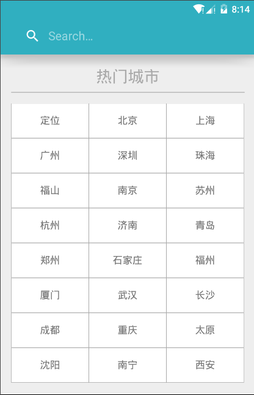
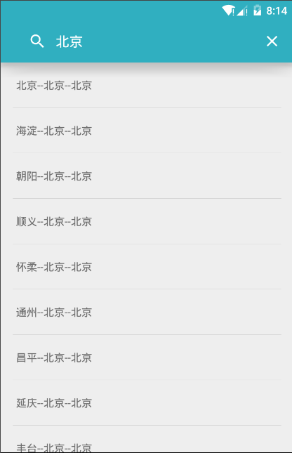
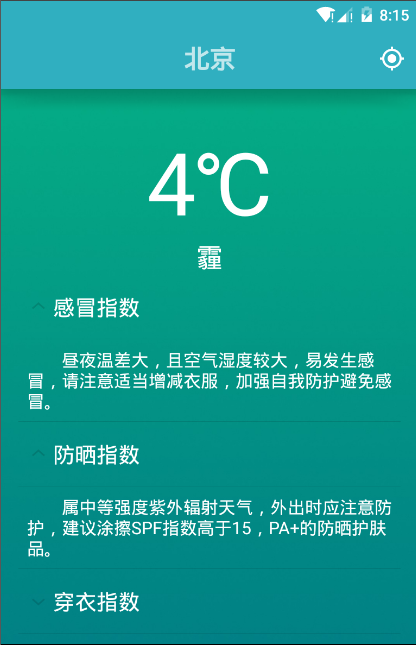
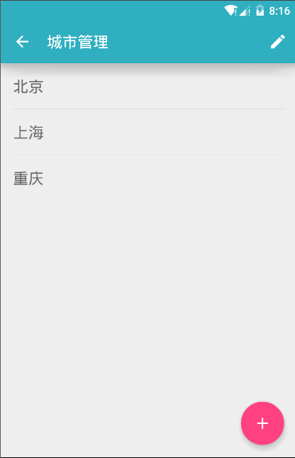

# 简易天气
> 本人在Android学习过程中做的一个小项目

## 实现的功能

  * 定位功能（[用到的百度的定位SDK](http://lbsyun.baidu.com/index.php?title=android-locsdk)）
  * 查找天气城市
  * 显示天气信息（天气、温度、各种指数、未来天气）
  * 城市信息的管理（添加、删除）
  > 天气信息数据来自[Api Store](http://apistore.baidu.com/apiworks/servicedetail/112.html)的免费接口，已失效！！！
## 用到的技术

  * UI是Material Design风格（苦逼不会设计，泪目...）
  * Api Store与百度定位SDK就不说了，网上的文章文档都挺全
  * 网络请求没事使用第三方框架，而是用HttpURLConnection封装了一个HttpUtil类来进行网络请求操作，获取接口返回的Json字符串
  * 使用[Gson](https://github.com/google/gson)解析请求下来的Json数据
  * 将城市信息在Sqlite中进行缓存，使得添加的城市信息在程序退出时不会丢失

# 下面附上几张截图

---

# TODO
  持续修复出现的问题...
